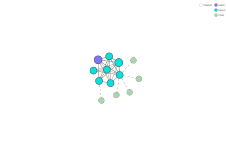

# Matter over Thread

## Capture n2: Topology B

## Devices

| Device | RLOC16 | Ext Address | IPv6 |
| --- | --- | --- | --- |
| OTBR | 0x3c00 | e2:f7:ef:32:aa:9a:c4:74 | fdb5:c4e4:f57d:1:f579:5a68:466c:8819 |
| ESP1light | 0x0c00 | e6:14:bc:0b:17:6d:9c:88 | fdb5:c4e4:f57d:1:5f98:8be7:6033:39bd |
| ESP2light | 0xa000 | 22:c9:65:73:69:09:f1:eb | fdb5:c4e4:f57d:1:d848:f2f8:900c:9d0 |
| ESP3light | 0xb400 | 56:76:f6:0a:c0:0a:49:89 | fdb5:c4e4:f57d:1:ac19:76b6:773d:1a93 |
| ESP4sensor | 0x0c03 | 9e:59:6e:0b:b1:6a:57:35 | fdb5:c4e4:f57d:1:e4d8:d3ea:22f0:b360 |
| ESP5sensor | 0x0c02 | 6e:e9:1b:23:48:76:6c:d5 | fdb5:c4e4:f57d:1:f864:b38f:31e:c84e |
| ESP6sensor | 0x0c04 | ee:9b:03:d8:b7:12:db:5d | fdb5:c4e4:f57d:1:2cc4:8974:2d6b:7eee |
| AqaraDoor | 0xa001 | c6:8c:58:1b:d5:5e:d4:89 | fdb5:c4e4:f57d:1:177c:e542:b37b:211b |
| AqaraMotion | 0x0c05 | a6:a4:53:ab:3e:30:7e:06 | fdb5:c4e4:f57d:1:bc6e:e728:c109:aae7 |
| HueWhite1549 | 0xf000 | 56:92:c4:a5:23:e0:f7:6c | fdb5:c4e4:f57d:1:b77f:54fa:205f:ad30 |
| HueWhite0475 | 0xd000 | 5e:b8:2c:c9:19:38:8f:d1 | fdb5:c4e4:f57d:1:1432:d42a:74f1:30c1 |
| Nanoleaf0176 | 0x5000 | f6:9d:0a:73:00:b9:5e:30 | fdb5:c4e4:f57d:1:1e:d549:c963:a584 |
| Nanoleaf1624 | 0x4800 | 1e:e4:8d:4c:6e:c8:0c:d3 | fdb5:c4e4:f57d:1:c173:df66:bed3:8d49 |

## Started

2025-12-21 16:50

## Thread decryption key

812332540e46c5022e266d9a983016c5

## Initial Network Topology



```text
id:15 rloc16:0x3c00 ext-addr:e2f7ef32aa9ac474 ver:4 - me - leader - br
    3-links:{ 52 }
    2-links:{ 03 18 45 60 }
    1-links:{ 20 40 }
    children: none
id:03 rloc16:0x0c00 ext-addr:e614bc0b176d9c88 ver:5
    3-links:{ 15 18 45 52 60 }
    2-links:{ 20 }
    children:
        rloc16:0x0c02 lq:3, mode:-
        rloc16:0x0c03 lq:3, mode:-
        rloc16:0x0c04 lq:3, mode:-
        rloc16:0x0c05 lq:3, mode:-
id:18 rloc16:0x4800 ext-addr:1ee48d4c6ec80cd3
    2-links:{ 03 15 40 45 }
    1-links:{ 52 }
    children: none
id:52 rloc16:0xd000 ext-addr:5eb82cc919388fd1 ver:4
    3-links:{ 15 }
    2-links:{ 03 45 }
    1-links:{ 60 }
    children: none
id:20 rloc16:0x5000 ext-addr:f69d0a7300b95e30
    2-links:{ 60 }
    1-links:{ 03 40 52 }
    children: none
id:60 rloc16:0xf000 ext-addr:5692c4a523e0f76c ver:4
    2-links:{ 20 }
    1-links:{ 03 15 40 52 }
    children: none
id:45 rloc16:0xb400 ext-addr:5676f60ac00a4989 ver:5
    3-links:{ 03 15 18 52 }
    2-links:{ 40 60 }
    children: none
id:40 rloc16:0xa000 ext-addr:22c965736909f1eb ver:5
    3-links:{ 18 60 }
    2-links:{ 15 20 45 }
    children:
        rloc16:0xa001 lq:3, mode:-
```

## Final Network Topology

```text
id:15 rloc16:0x3c00 ext-addr:e2f7ef32aa9ac474 ver:4 - me - leader - br
    3-links:{ 03 52 }
    2-links:{ 45 60 }
    1-links:{ 18 20 }
    children: none
id:03 rloc16:0x0c00 ext-addr:e614bc0b176d9c88 ver:5
    3-links:{ 15 18 45 52 60 }
    2-links:{ 20 }
    children:
        rloc16:0x0c02 lq:3, mode:-
        rloc16:0x0c03 lq:3, mode:-
        rloc16:0x0c04 lq:3, mode:-
        rloc16:0x0c05 lq:3, mode:-
id:18 rloc16:0x4800 ext-addr:1ee48d4c6ec80cd3
    2-links:{ 03 20 40 45 52 }
    1-links:{ 15 }
    children: none
id:52 rloc16:0xd000 ext-addr:5eb82cc919388fd1 ver:4
    2-links:{ 03 15 }
    1-links:{ 18 45 60 }
    children: none
id:20 rloc16:0x5000 ext-addr:f69d0a7300b95e30
    3-links:{ 18 }
    1-links:{ 03 40 52 60 }
    children: none
id:60 rloc16:0xf000 ext-addr:5692c4a523e0f76c ver:4
    2-links:{ 40 }
    1-links:{ 03 15 45 52 }
    children: none
id:45 rloc16:0xb400 ext-addr:5676f60ac00a4989 ver:5
    3-links:{ 03 15 18 40 52 }
    2-links:{ 60 }
    children: none
id:40 rloc16:0xa000 ext-addr:22c965736909f1eb ver:5
    3-links:{ 45 60 }
    2-links:{ 18 }
    children:
        rloc16:0xa001 lq:3, mode:-
```
